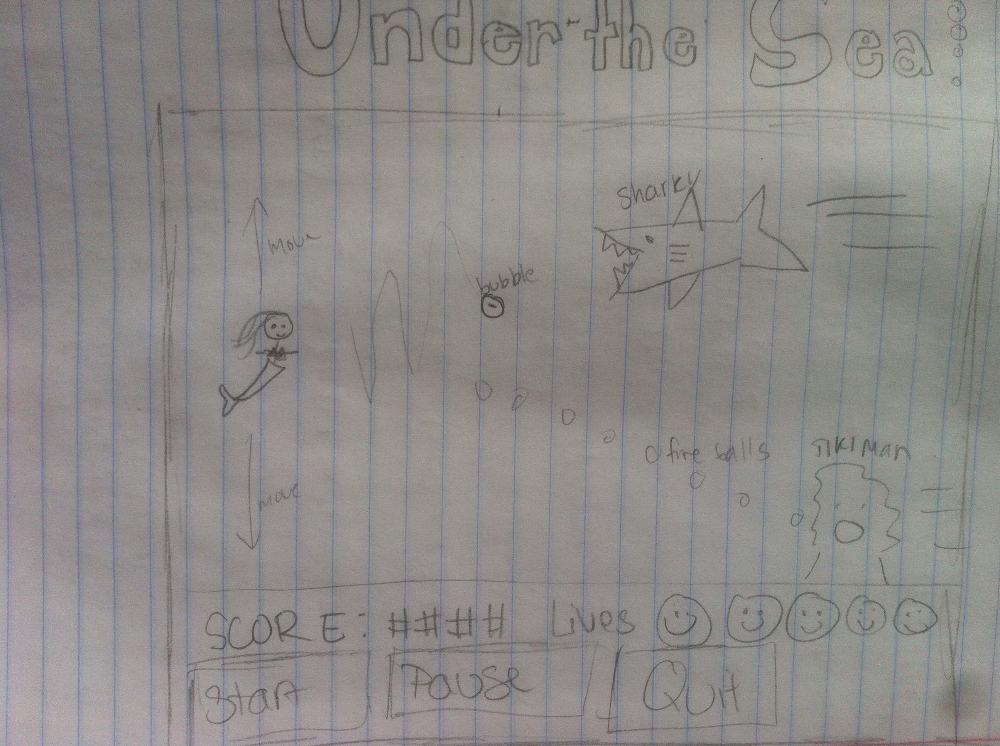
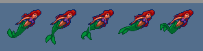
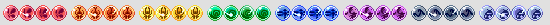
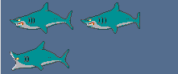
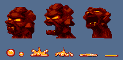

# Under the Sea
**Author:** Paige Kehoe
USC CSCI 102 Spring 2013
**Professor:** Mark Redekopp

## Game Setup
This is an infinite scroll game themed like the little mermaid. The player will be the mermaid and try to swim away from the monsters.  
	
	
	
### Characters
> **Mermaid**
	This is the character controlled by the user/ gameplayer.  
	
	
> **Bubble power**
	These bubbles will float along moving up and down toward her occasionally and, if caught, they give the mermaid extra lives.
	
	
> **Shark**
	Sharks swim toward the mermaid and try to eat her by following her location with a short time delay.  A shark kills the mermaid if it hits her.
	
	
> **Evil Tiki Man**
	The mermaid often swims by the tiki men.  The men move along the ground. They spit balls of fire at the mermaid that take away 1 life.
	
	
> **Poisonous Sea Weed**
	This seeweed is on the ground and sways back and forth.  If the mermaid touches it while swimming by, she loses a life.
	

### Gameplay
The mermaid starts swimming slowly and she has five lives.  The mermaid's movements are controlled by the up and down arrows on the keyboard. She accumulates points for every 3 seconds that she stays alive.  She also gets bonus points for getting the bubbles and acquiring more lives.  She looses points when she looses lives. She dies when she loses all her lives.  

