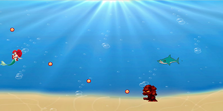
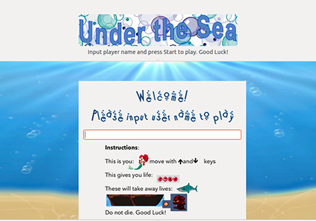

# Under the Sea
**Author:** Paige Kehoe
USC CSCI 102 Spring 2013
**Professor:** Mark Redekopp

## Game Setup
This is an interactive game themed like the little mermaid. The player will be the mermaid and try to swim away from the monsters. The game board looks like the drawing below:
	
	
	
	
	
### Characters
> **Mermaid**
	This is the character controlled by the user/ game player pressing the up and down arrow keys on the keyboard. 
	
	
> **Bubble power**
	These bubbles will move bouncing up and down from right to left toward the mermaid. If caught, they give the mermaid extra lives and 100 bonus points.
	
	
> **Shark**
	Sharks swim toward the mermaid across the screen from right to left and try to eat her by following her location with a short time delay.  A shark takes a life away from the mermaid if it hits her.
	
	
> **Evil Tiki Man**
	The tiki man appears on level two. He is stationary and spits balls of fire at the mermaid that take away 1 life each hit.
	
	
	
> **Pirate Ship**
	Pirates ships move along the top of the screen from right to left. If the mermaid collides with it while swimming by, she loses a life.
	

### Game play
The mermaid starts swimming and she has five lives.  The mermaid's movements are controlled by the up and down arrows on the keyboard. She accumulates points for the amount of time that she stays alive and bonus points for getting the bubble power-ups.  She also gets 1 extra life for every bubble she catches.  She dies when she loses all her lives.  As the game progresses, velocities of the monsters speed up and it becomes more challenging for the player to avoid all of the dangers. There should also be a menu bar at the bottom containing start, pause, stop game, and quit buttons for the user. 

