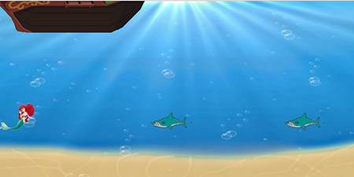
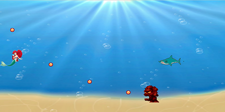
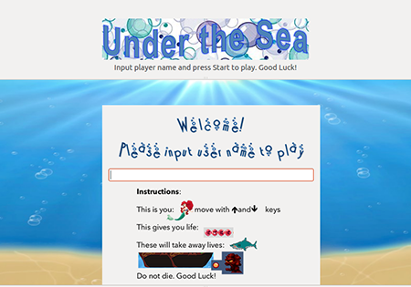

# Game - Programming Assignments Private Repository
### Student Information
  + Name: Paige Kehoe
  + USC Email: pkehoe@usc.edu
  + USC ID: 7810442065

### Game Information
  + Game Name: Under the Sea
  + Game Description: A fun interactive mermaid game in which you try to survive and avoid the monsters!
  + [Game Design Doc](GameDesignDoc.md)


### Compile & Run Instructions
The grader should use the following procedure to compile and run the code:
```shell
#Compile Instructions
qmake -project
qmake
make
#Doxygen Instructions
doxygen -g config.txt
doxygen config txt
#Command to run
./game_pkehoe
```

### Screenshots
	
	
	
